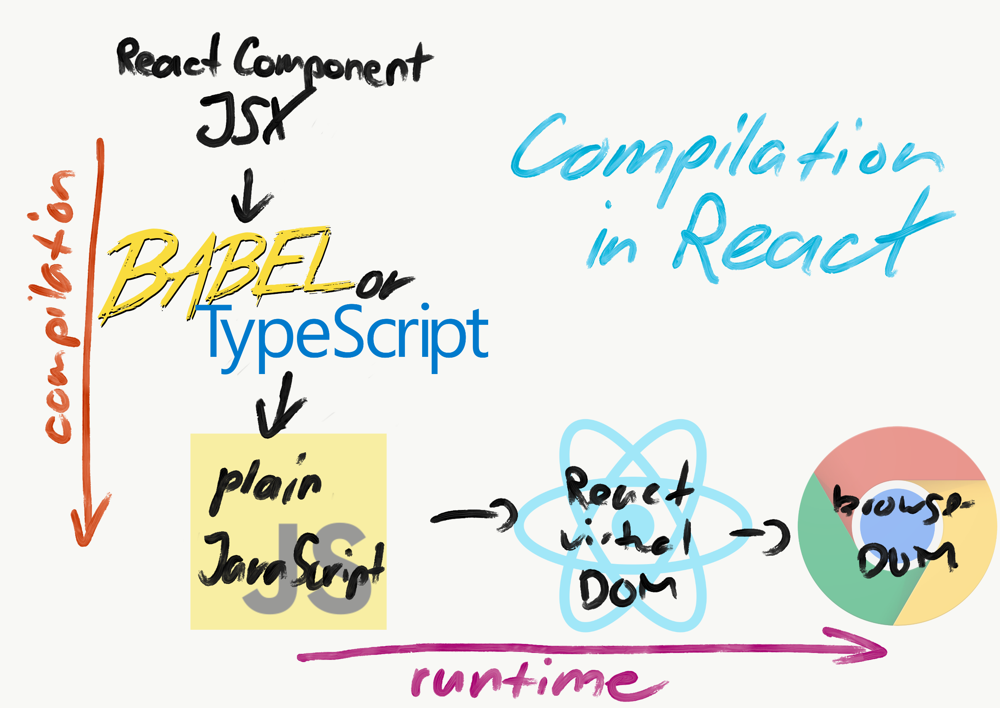
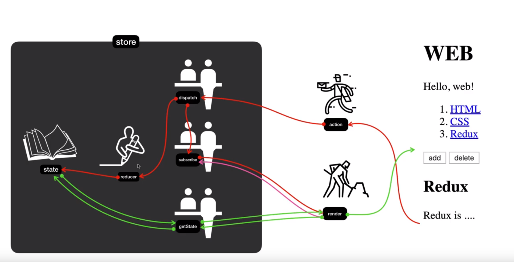
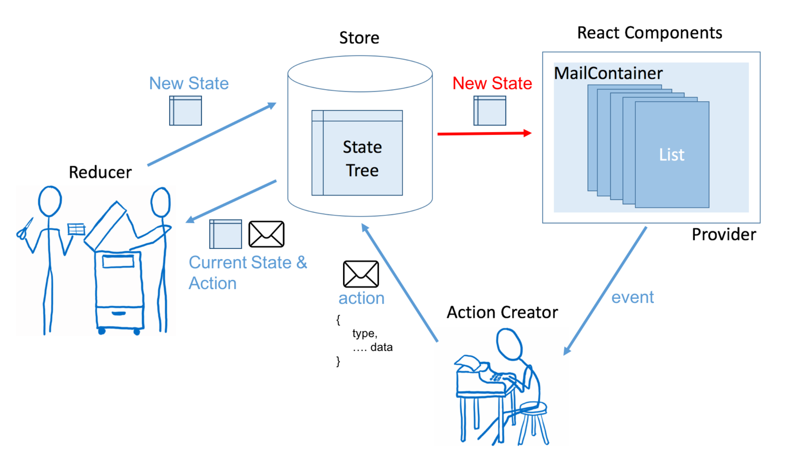

# :pushpin: React
React.js study repository :rocket:

----------------------------------
* react library
1) [react-filepond](https://github.com/pqina/react-filepond) : file upload library
> usage
```javascript
import { FilePond, registerPlugin } from "react-filepond"
import FilePondPluginImageExifOrientation from "filepond-plugin-image-exif-orientation"
import FilePondPluginImagePreview from "filepond-plugin-image-preview"
import 'filepond/dist/filepond.min.css'
import 'filepond-plugin-image-preview/dist/filepond-plugin-image-preview.min.css'
:
render() {
    return (
      <div className="App">
        {/* Pass FilePond properties as attributes */}
        <FilePond
          ref={ref => (this.pond = ref)}
          files={this.state.files}
          allowMultiple={true}
          maxFiles={3}
          server="/api"
          oninit={() => this.handleInit()}
          onupdatefiles={fileItems => {
            // Set currently active file objects to this.state
            this.setState({
              files: fileItems.map(fileItem => fileItem.file)
            });
          }}
        />
      </div>
    );
  }
```

2) [react-draft-wysiwyg](https://jpuri.github.io/react-draft-wysiwyg/#/)
> usage

```javascipt
import React, { Component } from 'react';
import { Editor } from 'react-draft-wysiwyg';

<Editor
  wrapperClassName="wrapper-class"
  editorClassName="editor-class"
  toolbarClassName="toolbar-class"
  wrapperStyle={<wrapperStyleObject>}
  editorStyle={<editorStyleObject>}
  toolbarStyle={<toolbarStyleObject>}
/>
```

3) [react-text-mask](https://github.com/text-mask/text-mask/tree/master/react#readme)
> usage
```javascript
<MaskedInput
  mask={['(', /[1-9]/, /\d/, /\d/, ')', ' ', /\d/, /\d/, /\d/, '-', /\d/, /\d/, /\d/, /\d/]}
  className="form-control"
  placeholder="Enter a phone number"
  //  you can input value
  value={this.state.number}
  guide={false}
  id="my-input-id"
  onBlur={() => {}}
  onChange={() => {}}
/>
```

4) [classNames](https://github.com/JedWatson/classnames#readme)
> like **Vue.js class style binding**
```javascript
classNames('foo', 'bar'); // => 'foo bar'
classNames('foo', { bar: true }); // => 'foo bar'
classNames({ 'foo-bar': true }); // => 'foo-bar'
classNames({ 'foo-bar': false }); // => ''
classNames({ foo: true }, { bar: true }); // => 'foo bar'
classNames({ foo: true, bar: true }); // => 'foo bar'

// lots of arguments of various types
classNames('foo', { bar: true, duck: false }, 'baz', { quux: true }); // => 'foo bar baz quux'

// other falsy values are just ignored
classNames(null, false, 'bar', undefined, 0, 1, { baz: null }, ''); // => 'bar 1'
```
--------------------------------------------------------------
### 1) shouldComponentUpdate ()
> [Life Cycle](https://ko.reactjs.org/docs/react-component.html)
* render() 함수 실행 여부를 개발자가 결정할 수 있음. 불필요한 렌더링을 막을 수 있음.
```javascript
import React, { Component } from 'react';
class TOC extends Component {
  shouldComponentUpdate (newProps, newState) {
    //  바뀐 state와 state의 값을 받을 수 있음
    if (this.props.data === newProps.data) {
      return false;
    }
    return true;
  }
}
```

### 2) setState()
> props로 받은 내용을 수정할 때는, setState()로 수정해야한다.

```javascript
<header>
  <h1><a href="/" onClick={function(e) {
        this.setState({ mode: 'welcome' });
       }.bind(this)}>{ this.state.subject.title }</a>
  </h1>
</header>
```

> shouldComponentUpdate()함수를 사용한다면 concat, Array.from()과 같은 함수를 사용해서 원본을 바꾸지 않는다.
* arr copy : **Array.from()**
* object copy : **Object.assign()**

```javasript
var a = {name: 'tonz'};
var b = Object.assign({}, a); //  {name: 'tonz'}
var c = Object.assign({left: 1, right: 2}, a);  //  {left: 1, right: 2, name: 'tonz'}
```

### 3) Component

> render 함수의 리턴 값은 항상 최상위 태그부터 시작해야한다.

```javascript
import React, { Component } extends from 'react';

class Subject extends Component {
  render () {
    return (
      <header>
        <h1>WEB</h1>
        world wide web!
      </header>
    );
  }
}

class App extends Component {
  render () {
    return (
      <div classNAme="App">
        <Subject></Subject>
      </div>
    );
  }
}

export default App;
```

### 3) props

* Subject.js

> 내부에서 this.props로 접근한다.

```javascript
class Subject extends Component {
  render () {
    return (
      <header>
        <h1>{ this.props.title }</h1>
        { this.props.sub }
      </header>
    );
  }
}
```

* App.js

```javascript
class App extends Component {
  render () {
    return (
      <div classNAme="App">
        <Subject title="WEB" sub="world wide web!"></Subject>
      </div>
    );
  }
}
```

### 4) directory structure

```
src
  -components
    -Subject.js
    :
  -App.js
```

* Subject.js

> impornt & export

```javascript
import React, { Component } extends from 'react';

class Subject extends Component {
  render () {
    return (
      <header>
        <h1>{ this.props.title }</h1>
        { this.props.sub }
      </header>
    );
  }
}

export default Subject;
```

* App.js

```javascript
import Subject from './Components/Subject'

class App extends Component {
  render () {
    return (
      <div classNAme="App">
        <Subject title="WEB" sub="world wide web!"></Subject>
      </div>
    );
  }
}
```

### 5) state

* **constructure()**
> 컴포넌트가 실행될 때, 가장 먼저 실행되며 초기화를 담당한다.
> 상위 컴포넌트 값을 하위 컴포넌트로 전달하고 싶을 때, state를 이용.

```javascript
import Subject from './Components/Subject'

class App extends Component {
  constructure (props) {
    super(props);
    this.state = {
      subject: {title: 'WEB', sub: 'world wide web!'}
    }
  }
  render () {
    return (
      <div classNAme="App">
        <Subject
          title={this.state.subject.title}
          sub={this.state.subject.sub}>
        </Subject>
      </div>
    );
  }
}
```

> state 값이 갱신되면 render()가 실행되며, 변경된 부분만 update된다.

```javascript
class Clock extends Component {
  constructure (props) {
    super(props);
    this.launchClock
    this.state = {
      //  초기 상태에 현재 시각 추가
      currentTime: (newDate()).toLocaleString('en')
    }
  }
  launchClock () {
    setInterval(() => {
      this.setState({
        //  매 초마다 현재시각으로 상태 갱신
        currentTime: (newDate()).toLocaleString('en')
      });
    }, 1000);
  }
  render () {
    return (
      <div>
      { this.state.currentTime }
      </div>
    );
  }
}
```

* **key**
> TOC 컴포넌트에서 data[i] 등의 방식으로 접근 가능함.
> 각 배열의 요소는 key로 구분하면됨. vue의 v-for의 key값과 동일.

```javascript
class App extends Component {
  constructure (props) {
    super(props);
    this.state = {
      subject: {title: 'WEB', sub: 'world wide web!'},
      contents: [
        {id: 1, title: 'HTML', desc: 'HTML is HyperText...'}
        {id: 2, title: 'CSS', desc: 'CSS is for design'}
        {id: 3, title: 'JS', desc: 'JS JS JS'}
      ]
    }
  }
  render () {
    return (
      <div classNAme="App">
        <Subject
          title={this.state.subject.title}
          sub={this.state.subject.sub}>
        </Subject>
        <TOC data={this.state.contents}></TOC>
      </div>
    );
  }
}
```

### 6) JSX

* if/else statement in JSX

```javascript
render () {
  let sessionFlag = this.props.user.session //  bull
  return (
    <div>
      <a href={(sessionFlag) ? '/logout' : '/login'}>
        {(sessionFlag) ? 'Logout' : 'Login'}
      </a>
    </div>
  )
}
```

> 다음은 틀린 구문이다. 중괄호 내에서 return문을 사용하지 않는다. 삼항 연산자를 사용한다.

```javascript
class={if(!this.props.admin) return 'hide'}
```

* JSX is converted to javascipt

<p align="center">
  	
</p>

* data-속성

> 사용자 정의 속성을 이용할 때, data- prefix를 붙히지 않으면 React에서는 렌더링되지 않는다. HTML 표준 속성이 아니기 때뮨.

```javascript
//  rendering OK in React
<li data-object-id="321"></li>

//  not rendering in React
<li object-id="321"></li>
```

* style

> 문자열 대신 자바스크립트 객체를 전달한다. css는 카멜케이스 표기

```javascript
let smallFontSize = {fontSize: '10px'}
<input style={smallFontSize}>
```

* class & for

> React와 JSX는 class, for를 제외하면 표준 HTML 속성을 모두 사용할 수 있다.

```javascript
<div className="hidden">...</div>
:
<label htmlFor={this.props.name}>
  {this.props.label}
</label>
:
```

* Boolean 값을 속성 값으로 사용하는 경우
> disabled, required, checked, autofocus, readOnly와 같은 일부 속성은 폼 요소에만 사용한다. 속성 값은 반드시 {} 안에 자바스크립트 식으로 작성해야 한다.

```javascript
//  GOOD
<input disabled={false} />
//  XXX !!!!
<input disabled="false" />
```

### 7) [Redux](https://www.youtube.com/playlist?list=PLuHgQVnccGMB-iGMgONoRPArZfjRuRNVc)

<p align="center">
  	
</p>

ex) [React 적용가이드](https://d2.naver.com/helloworld/1848131)

#### 1) [React 컴포넌트 만들기](https://github.com/naver/react-sample-code/blob/master/src/component/todolist/TODOList.js): 하위 React 컴포넌트로 prop(or state)와 dispatch() 메서드를 전달한다.

```javascript
const todolistStateToProps = (state) => {
  return {
    todos: state.todos
  }
}

const todolistDispatchToProps = (dispatch) => {
    return {
        onClick(data){
          dispatch(complete(data))
        }
    }
}
//  connect의 첫번째 parameter는 state, 두번째 parameter는 dispatch 함수
export default connect(todolistStateToProps,todolistDispatchToProps)(TODOList);
```

#### 2) [액션 명령어와 액션 메서드 만들기](https://github.com/naver/react-sample-code/blob/master/src/action/todo.js#L20-L30): state 변경과 비동기 처리를 구현한다.
```javascript
function complete({complete, id}) {
	return { type: COMPLETE_TODO,  complete, id};
}

function complete2(data2) {
  return (dispatch) => {
    return fetch("api/add.json").then(
      res => res.json().then(data => dispatch(complete(data2)))
    );
  };
}
```

#### 3) [리듀서 생성](https://github.com/naver/react-sample-code/blob/master/src/reducer/todos.js#L29-L40): 스토어의 구조를 정한다.

```javascript
const todos = (state = [], action) => {
  switch (action.type) {
    case ADD_TODO:
      return [
        ...state, todo(undefined, action)
      ];
    case COMPLETE_TODO:
      return state.map(t => todo(t, action));
    default:
      return state;
  }
}
```

#### 4) [dispatch() 메서드에 액션 결과 전달](https://github.com/naver/react-sample-code/blob/master/src/component/todolist/TODOList.js#L35): 액션의 결과를 전달한다.
---------------------------------------------------------------------------------------------------------------------
ex) [Redux의 이해](https://d2.naver.com/helloworld/4966453)

<p align="center">
  	
</p>

* store
> 한 개의 계층형 객체.
> 애플리케이션의 state를 가지고 있다.

* React Component
> stae에 맞게 화면을 그린다.

* action creator
> 사용자가 발생시키는 이벤트에 맞춰 스토어에 전달할 액션을 만든다.
> 액션생성자가 만드는 액션은 [순수객체]다.

* reducer
> 현재 state와 액션을 전달받아 새로운 state를 반환한다.
> 리듀서는 [순수 함수]다.

### 8) [props-type](https://ko.reactjs.org/docs/typechecking-with-proptypes.html#___gatsby)

```javascript
class DatePicker extends Component {
 :
}
:
DatePicker.propTypes {
 currentDate: PropTypes.string.isRequired,
 rows: PropTypes.number,
 // 열거형(enum)으로 처리하여 prop가 특정 값들로 제한되도록 할 수 있습니다.
 locale: PropTypes.oneOf(['US', 'KO']),
}
```

### 9) HOC
> 코드 재사용을 위한 React 고차 컴포넌트

```javascript
const LoadWebSite = (Component) => {
 :
 class _LoadWebSite extends Component {
  :
  _LoadWebSite.displayName = 'Enhanced Component'
  return _LoadWebSite
 } 
}
```
### 10) 컨테이너 컴포넌트 & 프레젠테이션 컴포넌트

* 프레젠테이션 컴포넌트
> DOM과 스타일에 구조만 추가한다. 속성(props)는 사용하지만 상태(state)를 갖는 경우는 거의 없다.
